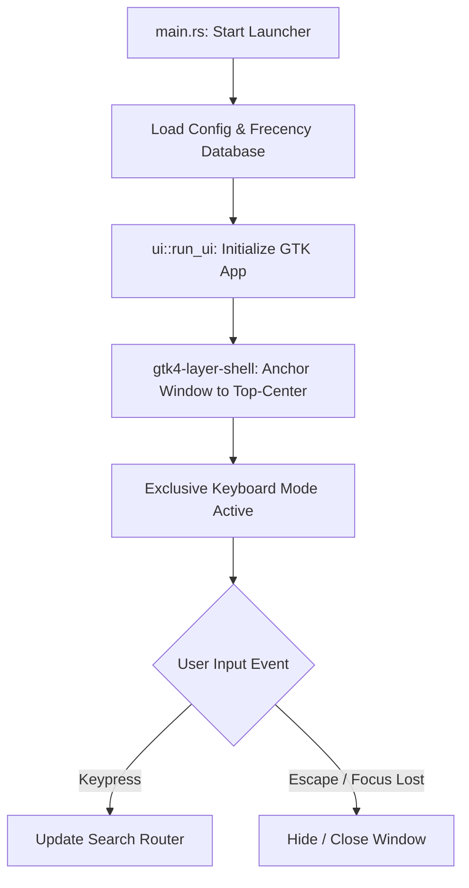

# System Architecture

This document covers the high-level system architecture, window lifecycle, fuzzy scoring engine, and async communication model.

---

## 1. Application Loop & Wayland Layer Shell

The application is built on top of **GTK4** and utilizes the **wlr-layer-shell** protocol wrapper `gtk4-layer-shell` to render desktop-level overlays.

### Window Setup
* **Layer Surface**: Set to `Layer::Overlay` to float on top of all application windows.
* **Keyboard Mode**: Set to `KeyboardMode::Exclusive` when active. This locks the system keyboard focus to the launcher entry box, letting you start typing immediately.
* **Decoration**: The window is undecorated (`set_decorated(false)`). The monotone margins and shadow-borders are styled manually in GTK CSS to give a floating card illusion.
* **Anchoring**: The main window is anchored to the top-center of the screen.

---

## 2. Threading & Communication Model

GTK4 is strictly single-threaded; all UI modifications must occur on the main thread. To prevent blocking the UI during heavy operations (like D-Bus calls, file I/O, or web translations), the launcher uses asynchronous channels (`std::sync::mpsc::channel`) and GLib main loop timeouts.

### Example: Background Translation Flow
1. **Selection**: User types `t: hello` and hits Enter to translate.
2. **Main Thread Hiding**: The main window hides itself (`window.hide()`) to disappear immediately, but the application process is kept alive.
3. **Background Worker Spawn**: The translation plugin spawns a background thread.
4. **Network Request**: The background worker calls the translation API synchronously.
5. **GLib Timeout Loop**: The main thread runs a GLib local timeout callback every 50ms (`glib::timeout_add_local`) to poll the receiver channel.
6. **Result Window Creation**: Once the result is received, the main thread creates and presents the translation result window, and terminates the polling loop.

---

## 3. Fuzzy Routing & Frecency Ranking

Search results are routed, filtered, and sorted in `src/router.rs`.

### Ranking Formula
The score for any query item is determined by combining fuzzy matching score and a decay-based usage score (frecency):

$$\text{Final Score} = \text{Fuzzy Match Score} + \text{Frecency Score}$$

* **Fuzzy Matching**: Evaluated via the `fuzzy-matcher` crate (using the Clangd/Sublime-text style algorithm). Points are awarded for matches, consecutive characters, and matches at word boundaries.
* **Frecency Score**: The Frecency database stores historical usage times and click counts. Each time an item is executed, its score increases. Older clicks decay over time using a half-life decay function, ensuring recently used apps rank higher.
